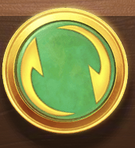
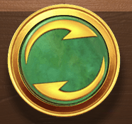

- using spinBtn.png, this is a sprite sheet, you need to use this to draw spin button that will have rotate animation. Result should look like this:

- create new composable useSpinBtn to draw spin button and move all the spin button related logic
